<p align="center">
  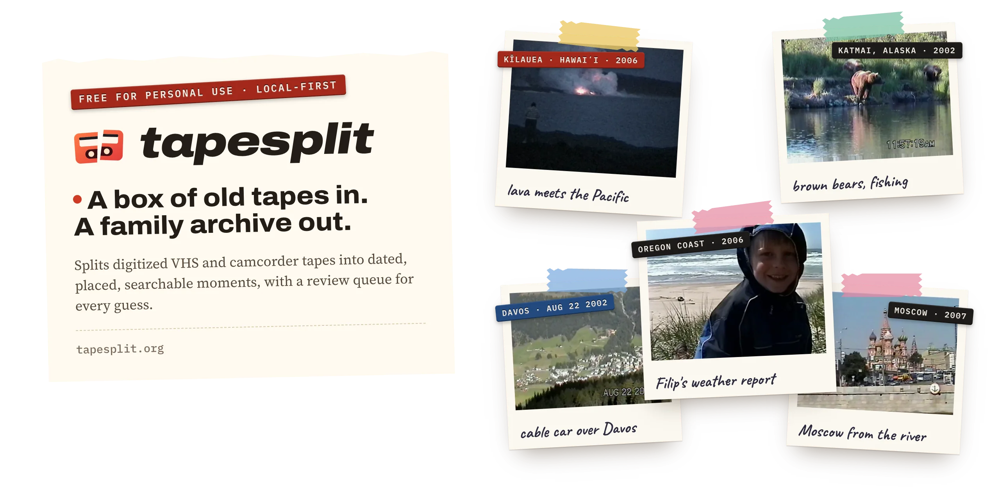
</p>

<p align="center">
  <a href="https://bindeman.github.io/tapesplit/"><b>Website</b></a> ·
  <a href="#quickstart"><b>Quickstart</b></a> ·
  <a href="#one-morning-taken-apart"><b>How it works</b></a> ·
  <a href="#api-keys"><b>API keys</b></a> ·
  <a href="docs/"><b>Docs</b></a>
</p>

<p align="center">
  <a href="https://github.com/bindeman/tapesplit/actions/workflows/ci.yml"></a>
  
  
  <a href="LICENSE"></a>
</p>

**TapeSplit turns a box of digitized VHS and camcorder tapes into a family archive you can browse, search and trust.** It watches every hour of footage, splits each tape into moments, and works out when each moment happened, where, and who was there. Anything it isn't sure about waits in a review queue. It runs on your Mac; cloud models are optional and capped at a dollar amount you set.

> Every picture on this page is a real frame from my family's tapes (1997–2007), labeled by TapeSplit. Names other than mine are changed.

## From the tapes

<p align="center">
  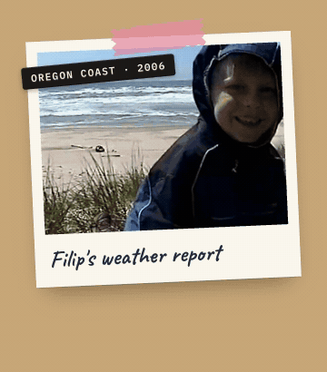
  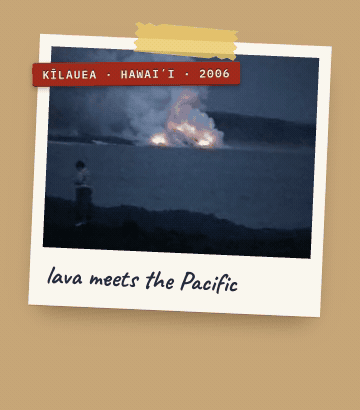
  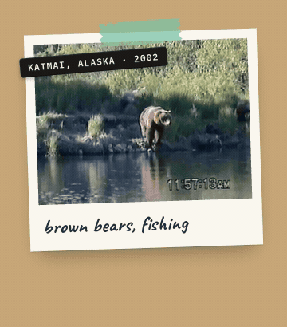
  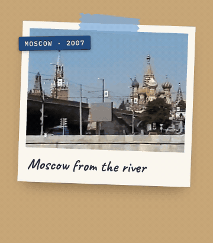
</p>

The captions are scrapbook notes. The label tape is TapeSplit's: where each trip was and what year, worked out from what's on screen, what's said on tape and the camcorder's date stamp.

## One tape, split

<p align="center">
  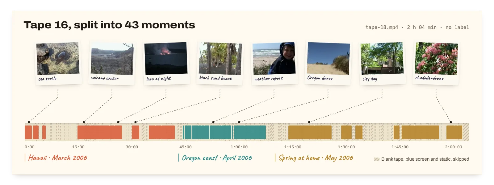
</p>

Tape 16 came back from the digitizer as `tape-18.mp4`: two hours and four minutes with no label. TapeSplit found 43 moments in it across a trip to Hawaii, a weekend on the Oregon coast and a spring at home, and skipped the blank tape, blue screens and static in between. The whole first archive was 19 tapes and 31 hours; it came back as 279 moments, 101 people and 244 places.

## One morning, taken apart

Tape 18 has no label either. An hour in, the camcorder's clock reads SEP 1 2005 in a Moscow courtyard, then SEP 7 2005 on a lawn in Eugene, Oregon, then FEB 17 2006. Here's what TapeSplit made of the Wednesday in the middle, Filip's first day of first grade.

<p align="center">
  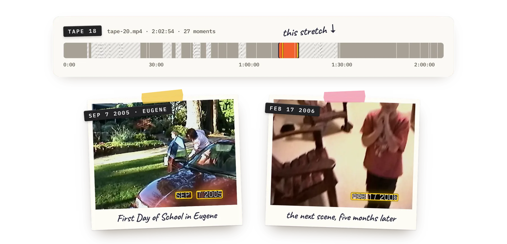
</p>

**When.** For a few seconds after you press record, a camcorder burns the date into the picture. The video model read this one as SEP 7 2005 (Apple Vision found it too, in two pieces), and the teacher's whiteboard says the same day. Dates that don't describe the moment are left out: a file's own date (the day it was digitized) and years mentioned in passing.

<p align="center">
  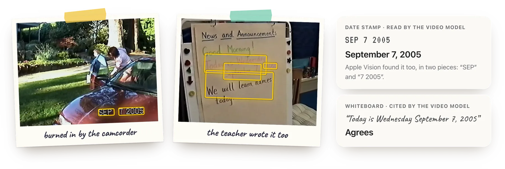
</p>

**Where.** Mom says they're back in Eugene, and the sign over the doors says Maplewood School. A search for that name alone picked a school in Florida, with others in Utah and Arizona. None of those is anywhere this family lived, so TapeSplit flagged the match and searched again near home, and a separate verifier agreed the school belongs in Eugene.

<p align="center">
  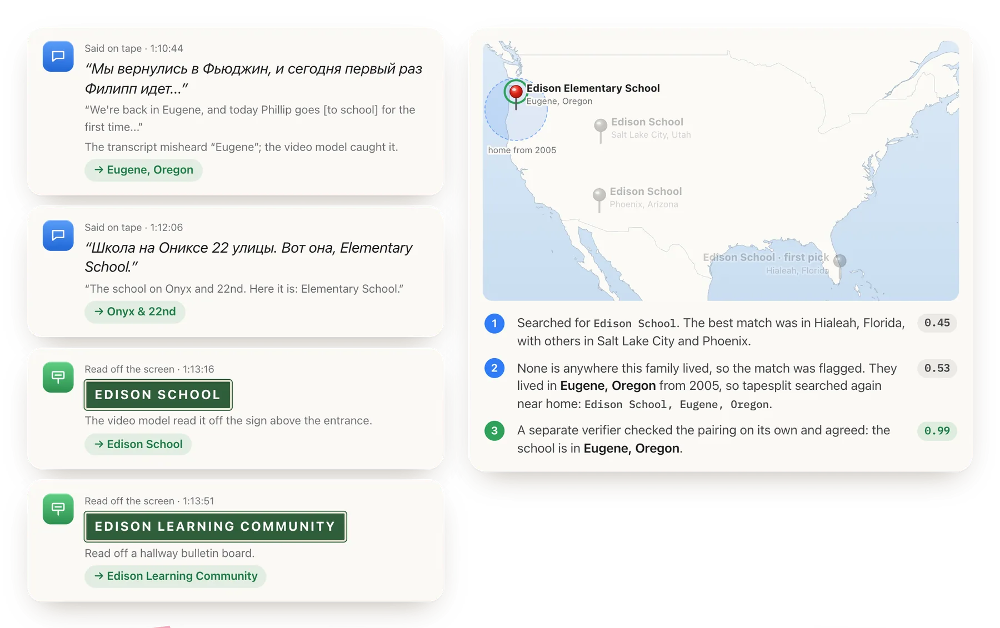
</p>

**Who.** Two voices, separated and lined up with their words. Mom asks, in Russian, what Filip thinks of his first day; he says he isn't scared. Names for voices are suggestions you confirm in Review.

<p align="center">
  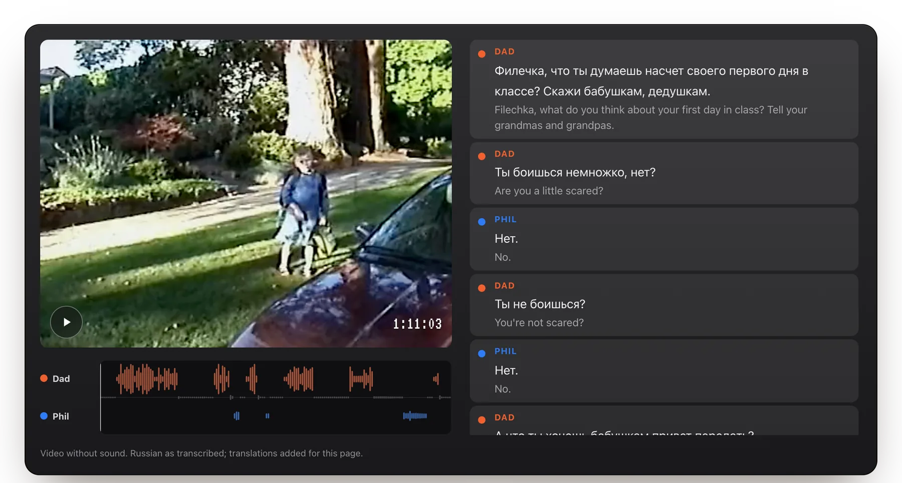
</p>

**Language.** Russian and English, sometimes in one sentence. Every line stays in the language it was spoken, and search works across both: type "grandma and grandpa" and it finds «Скажи бабушкам, дедушкам».

<p align="center">
  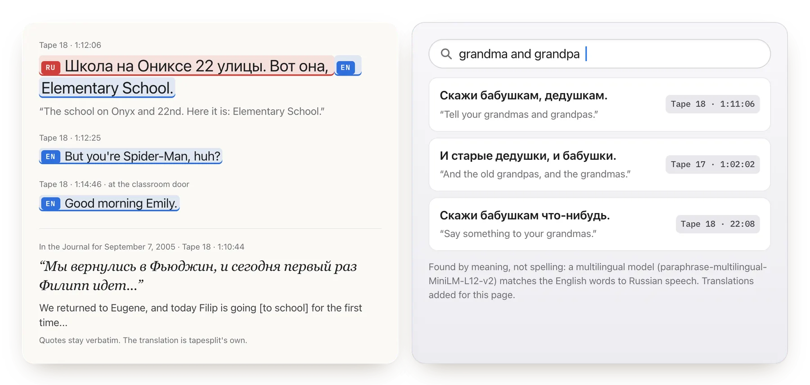
</p>

### Nineteen tapes, one timeline

<picture>
  <source media="(prefers-color-scheme: dark)" srcset="site/media/readme/timeline-dark.webp">
  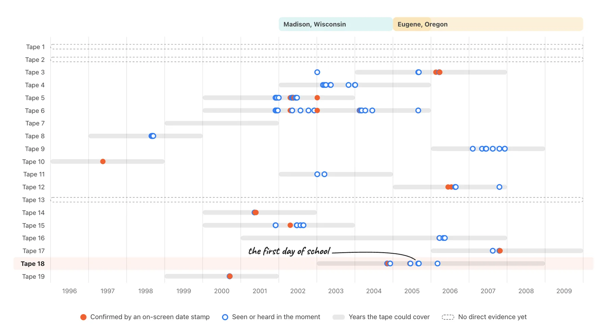
</picture>

Tapes get reused and recorded over, so tape order isn't time order: Tape 3 jumps from 2003 to 2006. TapeSplit dates each moment on its own. 99 of the 279 got an exact day: 29 confirmed by a camcorder stamp that Apple Vision read, and 75 from what the video model saw or heard in the moment. The rest borrow a month or year from the moments around them.

<sub>School, street and teacher names are changed. The English under the Russian lines was added for this page, except the Journal's, which is TapeSplit's own.</sub>

## What you get

A local review app that feels like a photo library. Every card links to the second of tape it came from.

<picture>
  <source media="(prefers-color-scheme: dark)" srcset="site/media/ui/library-tape16-dark.webp">
  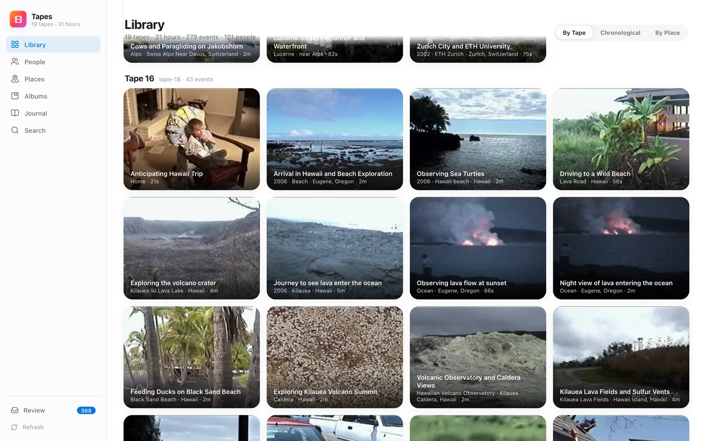
</picture>

<table>
  <tr>
    <td width="50%" valign="top">
      <picture>
        <source media="(prefers-color-scheme: dark)" srcset="site/media/ui/event-davos-dark.webp">
        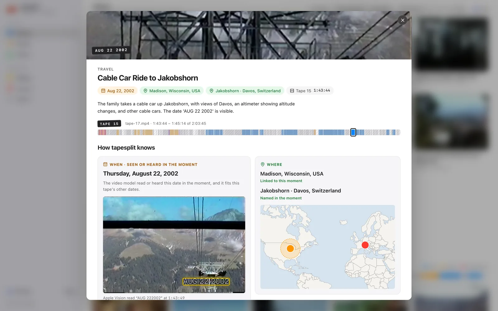
      </picture>
      <p><b>A moment</b> plays from the right second, with its keyframes, people and places. This date came off the camcorder stamp in the frame.</p>
    </td>
    <td width="50%" valign="top">
      <picture>
        <source media="(prefers-color-scheme: dark)" srcset="site/media/ui/journal-post-dark.webp">
        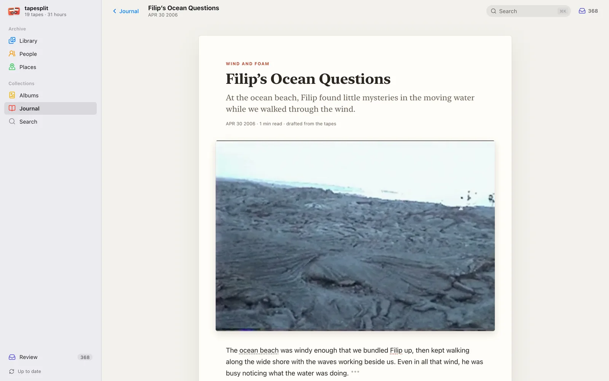
      </picture>
      <p><b>The Journal</b> drafts days from the tapes into short entries. Every sentence cites its clip, and quotes are verbatim, Russian included.</p>
    </td>
  </tr>
  <tr>
    <td width="50%" valign="top">
      <picture>
        <source media="(prefers-color-scheme: dark)" srcset="site/media/ui/review-dark.webp">
        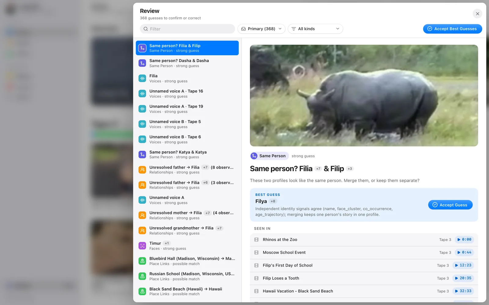
      </picture>
      <p><b>Review</b> holds the guesses that are left, each with its evidence. Accept the strong ones in bulk or fix one in a click.</p>
    </td>
    <td width="50%" valign="top">
      <picture>
        <source media="(prefers-color-scheme: dark)" srcset="site/media/ui/places-dark.webp">
        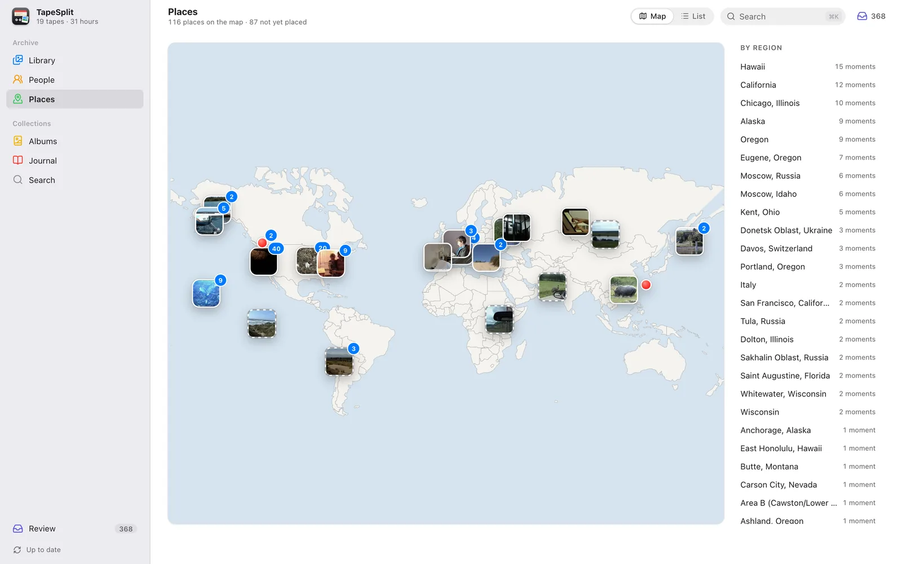
      </picture>
      <p><b>Places</b> puts everywhere the camera went on a map that works offline. Dashed pins are rough guesses.</p>
    </td>
  </tr>
</table>

## Under the hood

One command runs everything:

```bash
tapesplit auto ~/Tapes
```

`auto` is a 21-stage pipeline. Each stage checks what your machine can do and skips with a reason when it can't. Every stage is resumable, cloud stages are priced before they run, and the run ends by auto-accepting only the guesses that clear per-type safety rules.

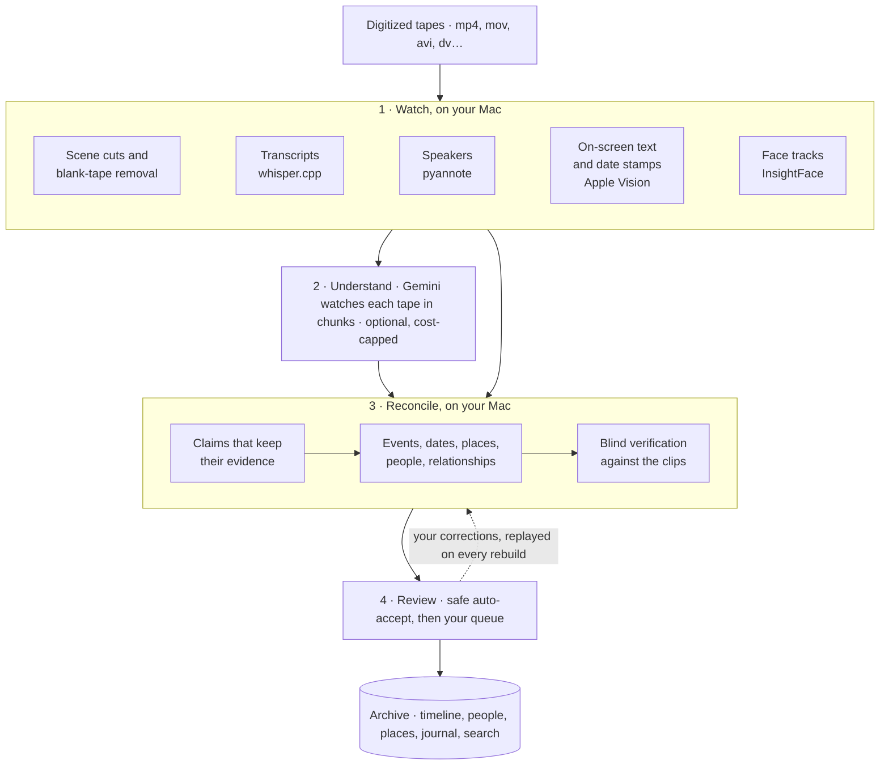

| Pass | What happens |
| --- | --- |
| **Watch** | ffmpeg finds scene cuts and throws out blank tape, blue screen and static. whisper.cpp transcribes every word in whatever language was spoken. pyannote separates the voices. Apple Vision reads text in the frame, including the camcorder's burned-in date. InsightFace follows each face through the shot, and tracks are clustered into people. |
| **Understand** | Gemini on Vertex AI watches each tape in chunks and proposes events with timestamps: what happened, who is there, where and when. Long tapes are chunked, and each chunk is told its own duration so timestamps can't drift. Every batch is estimated first and skipped if it would exceed `--max-cloud-usd`. Without Gemini, TapeSplit still builds a timeline from local signals. |
| **Reconcile** | Every signal becomes a claim that keeps its source: a transcript line, a frame, a face track. Events are stitched across chunks and dated from stamps, speech and context. Names are reconciled, so Mom, Katya and Катя become one person, while home in 2003 and home in 2006 stay two places. A blind verifier re-checks a sample of claims against the clips. |
| **Review** | Strong guesses are accepted automatically under per-type confidence floors; a relationship also needs both people resolved and agreeing evidence. Everything else waits in the review queue. Corrections live in their own file and are replayed after every rebuild. |

The full stage list, state handling and safety policy are in [docs/AUTOMATION.md](docs/AUTOMATION.md).

### Built to be checked

- **Guesses look like guesses.** Inferred facts read "appears to be…", carry a confidence, and link to their evidence.
- **Your fixes stick.** Re-run the pipeline as often as you like; corrections replay on top.
- **It measures itself.** Blind clip verification gives each module a grounded-precision score, and that score decides when new logic ships.
- **Plain files.** A project is a folder of JSONL files, a SQLite search index and thumbnails. Nothing is locked in the app.

## Quickstart

You need Python 3.11+ and ffmpeg. Apple Silicon Macs are the best-tested setup; Linux runs everything except the Apple Vision stages, which fall back to OpenCV.

```bash
brew install ffmpeg whisper-cpp        # on Linux: your package manager, and build whisper.cpp
git clone https://github.com/bindeman/tapesplit
cd tapesplit
python3.12 -m venv .venv
.venv/bin/pip install -e '.[local-ai,vision,macos,visual-ai,face-ai,speaker-ai]'
cp .env.example .env                   # every key in it is optional

.venv/bin/tapesplit doctor                 # what this machine can run, stage by stage
.venv/bin/tapesplit auto ~/Tapes --plan    # what would run, without running it
.venv/bin/tapesplit auto ~/Tapes           # tapes in, archive out (~/Tapes.tapesplit)
.venv/bin/tapesplit ui ~/Tapes.tapesplit   # browse and review
```

For transcription, point `WHISPER_CPP_MODEL` in `.env` at a whisper.cpp model such as [`ggml-large-v3-turbo.bin`](https://huggingface.co/ggerganov/whisper.cpp/tree/main). The review app needs Node 20 or newer; `tapesplit ui` installs its packages on first run.

| Extra | Adds |
| --- | --- |
| `local-ai` | openai-whisper, sentence-transformers and sqlite-vec for dense multilingual search |
| `vision` | OpenCV face detection and frame analysis |
| `macos` | Apple Vision OCR and face detection |
| `visual-ai` | Image captions and visual embeddings |
| `face-ai` | InsightFace / ArcFace identity embeddings on ONNX Runtime (Core ML on Apple Silicon) |
| `speaker-ai` | pyannote.audio and SpeechBrain diarization |

Useful variants:

```bash
tapesplit auto ~/Tapes --profile local           # never call a cloud service
tapesplit auto ~/Tapes --max-cloud-usd 25        # raise the cloud budget for this run
tapesplit auto ~/Tapes --language ru             # transcription language hint
tapesplit auto ~/Tapes.tapesplit --force-from scenes   # redo scenes and everything after
tapesplit status ~/Tapes.tapesplit               # stage state and archive metrics
tapesplit search query ~/Tapes.tapesplit "first day of school"
```

Every stage is also its own command (`detect-scenes`, `transcribe`, `speakers diarize`, `gemini analyze-video`, `detect-faces`, `cluster-faces`, `search build`, `journal generate`, …). See `tapesplit --help` and [docs/LOCAL_SETUP.md](docs/LOCAL_SETUP.md).

## API keys

TapeSplit works with no keys at all. Each service you add makes one part of the archive better. Keys go in `.env` (gitignored); `tapesplit doctor` reports what it found without printing secrets.

| Service | What it adds | Setup | Without it |
| --- | --- | --- | --- |
| **Google Cloud (Vertex AI · Gemini)** | Watches the video itself: rich event titles, summaries, people, places and dates | Create a project with the Vertex AI API enabled and a Cloud Storage bucket, then run `gcloud auth application-default login`. Set `GOOGLE_CLOUD_PROJECT`, `GOOGLE_CLOUD_LOCATION` and `GEMINI_GCS_BUCKET`. | Low-confidence "recording segment" events from local signals |
| **Hugging Face** | pyannote speaker diarization | Create a read token, accept the terms of [`pyannote/speaker-diarization-community-1`](https://huggingface.co/pyannote/speaker-diarization-community-1), set `HF_TOKEN` | SpeechBrain fallback |
| **Azure OpenAI** | Diarized transcription that names known speakers, the blind verifier, frame descriptions and Journal drafting | Set `AZURE_OPENAI_ENDPOINT`, `AZURE_OPENAI_API_KEY`, `AZURE_OPENAI_API_VERSION` and the deployment names in `.env.example`. Opt in with `TAPESPLIT_DIARIZE_BACKEND=azure-openai` and `TAPESPLIT_VERIFIER_BACKEND=azure`. | Those stages skip with a reason |
| **Google Maps** | Sharper geocoding for named places | `GOOGLE_MAPS_API_KEY`, `GOOGLE_MAPS_ENABLED=true` and a `GOOGLE_MAPS_DAILY_BUDGET_USD` cap | OpenStreetMap Nominatim (free; set `TAPESPLIT_CONTACT_EMAIL` to identify yourself) |
| **TwelveLabs** | An optional hosted video index for search experiments | `TWELVELABS_API_KEY` and the `twelvelabs` extra | Local hybrid search |

**What it costs.** Gemini analysis of all 31 hours of the sample archive came to about $8 on Vertex AI. Three guards keep it bounded: `tapesplit auto` estimates each batch against `--max-cloud-usd` (default $10), `GEMINI_PROJECT_BUDGET_USD` caps cumulative Gemini spend, and `GOOGLE_MAPS_DAILY_BUDGET_USD` caps geocoding. Copy `cost_rates.example.json` to `cost_rates.json` to price calls with your own rates.

## Privacy

- **Local by default.** Every stage has a local path, and `--profile local` never makes a network call to an AI service.
- **What leaves your machine, when you opt in.** Gemini analysis uploads low-resolution proxies of your tapes to a Cloud Storage bucket in *your* Google Cloud project. The Azure stages send individual frames and short audio clips. Geocoding sends place names.
- **Your archive stays out of git.** Project folders (`*.tapesplit/`), media files, `.env` and `cost_rates.json` are all gitignored. Facts about one family (who usually held the camera, for example) go in `<project>/project_hints.json`, never in the code.
- **The review app is local-only.** Its dev server binds to 127.0.0.1 and refuses requests from other hosts or other websites.

## Project layout

```
src/tapesplit/     Python package and the `tapesplit` CLI: pipeline stages, models, adapters
apps/review-ui/    React + Vite review app (`tapesplit ui`)
docs/              Design notes: automation, entity resolution, relationships, retrieval, …
tests/             pytest suite (runs without the ML extras; heavy tests skip themselves)
site/              The project website, deployed to GitHub Pages
```

Start with [docs/HANDOFF.md](docs/HANDOFF.md) for the architecture tour. The other design notes:

- [AUTOMATION.md](docs/AUTOMATION.md): `tapesplit auto` stages, state, degradation and safety policies
- [REFOUNDATION.md](docs/REFOUNDATION.md): the claim-based semantic core and how it is verified
- [ENTITY_RESOLUTION.md](docs/ENTITY_RESOLUTION.md) and [RELATIONSHIP_INFERENCE.md](docs/RELATIONSHIP_INFERENCE.md): people, aliases, roles and family graphs
- [TEMPORAL_EVIDENCE_FABRIC.md](docs/TEMPORAL_EVIDENCE_FABRIC.md): the long-term evidence model
- [RETRIEVAL_ARCHITECTURE.md](docs/RETRIEVAL_ARCHITECTURE.md): hybrid full-text and vector search
- [LOCAL_FACE_STACK.md](docs/LOCAL_FACE_STACK.md): face tracks, embeddings and clustering
- [JOURNAL.md](docs/JOURNAL.md) and [DESIGN.md](docs/DESIGN.md): the Journal's grounding contract and the UI design standard

## Status

TapeSplit is an alpha. It runs end to end on a real 31-hour archive, and the review queue exists because it still makes mistakes, such as borrowing a place from the wrong era or attributing a quote to the wrong speaker. Next up:

- API-key backends for Gemini (AI Studio) and OpenAI, alongside Vertex AI and Azure
- A packaged desktop app with a native project picker
- A watch mode that picks up new tapes dropped into a folder

## Contributing

Issues and pull requests are welcome. See [CONTRIBUTING.md](CONTRIBUTING.md) for setup, house rules and the terms for contributions, and [SECURITY.md](SECURITY.md) to report a vulnerability privately. Please use fictional people and places in tests and bug reports, never real family footage, names or transcripts.

## License

TapeSplit is source-available under the [PolyForm Noncommercial License 1.0.0](LICENSE). You can use, study, change and share it for personal, family, educational, research and other noncommercial purposes. Commercial use, including use inside a business or as part of a paid product or service, needs written permission from the author ([phillipbindeman.com](https://phillipbindeman.com)).

The footage, stills, clips and screenshots under `site/media/` and on this page come from my family's tapes. They are © Phillip Bindeman, all rights reserved, and are not covered by the code license.

---

<p align="center"><sub>Built by <a href="https://phillipbindeman.com">Phillip Bindeman</a> with a box of family tapes.</sub></p>
